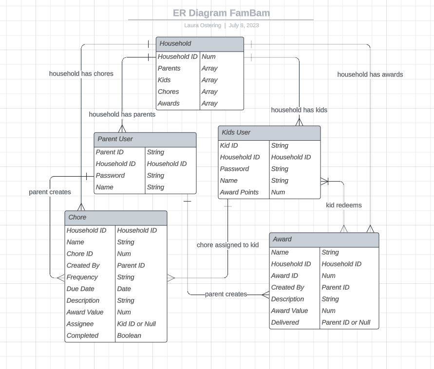

# FamBam

## SEIR Carina Capstone Project

An app for parents and kids to keep track of chores & tasks, and get awards & allowance.

## User Stories

- As a parent user, I want to..

  - Create a household
  - Create kid users
  - Create tasks (Bams)
  - Assign Bams to a kid
  - Assign Bams due dates, and award amounts

- As a kid user, I want to..
  - View Bams
  - Mark Bams complete

- Stretch Goal
  - Create awards
  - Redeem awards

## ERD / Trello / Wireframes / Screenshots

Entity Relationship Diagram

Trello Board - https://trello.com/b/vNUeoQjH/capstone

Wireframe

## Technologies Used

- HTML5
- CSS3
- JavaScript
- React
- Express
- Node
- Nodemon
- MongoDB
- Mongoose
- dotenv
- EJS
- Bootstrap
